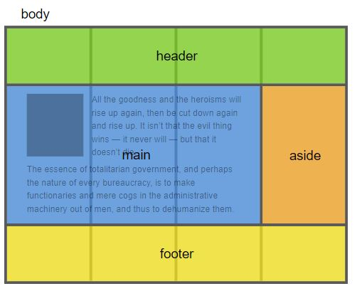

# Css Grid

Grid system in css is the 2 dimensional template maker which designed
for making web pages.

---

Before Grid system and flexbox, HTML tables, floats,
margins and simple divs were used to make general
template of a web page

---

Grid with flexbox gives frontend developers power to make
great templates

---

Grid is able to manage making layouts both vertically and horizontally
in the same time

---

Grid Container : the parent of grid items
.grid-container {
display: grid
=> container of type BLOCK
}
OR
.grid-container {
display: inline-grid
=> contianer of type INLINE
}
OR
.grid-container {
display: subgrid
=> container for items that are grid too
}

HTML is like index1.html

## [Grid container](index1.html)

## 

Gap lines:
In designs between rows and columns, there is a gap (like below)

## 

Be careful that grid parent only applies for direct children not
grant children.
For example, if we assign display: grid to body, main, footer, aside, header are organized based on grid system.
but the children of main, are not organized based on grid.

## 

grid-template-rows
--> defines size of rows

grid-template-columns
--> defines size of columns

example:
.grid-container {
grid-template-columns: 40px 50px auto 50px 40px;
grid-template-rows: 25% 100px auto;
}

---
